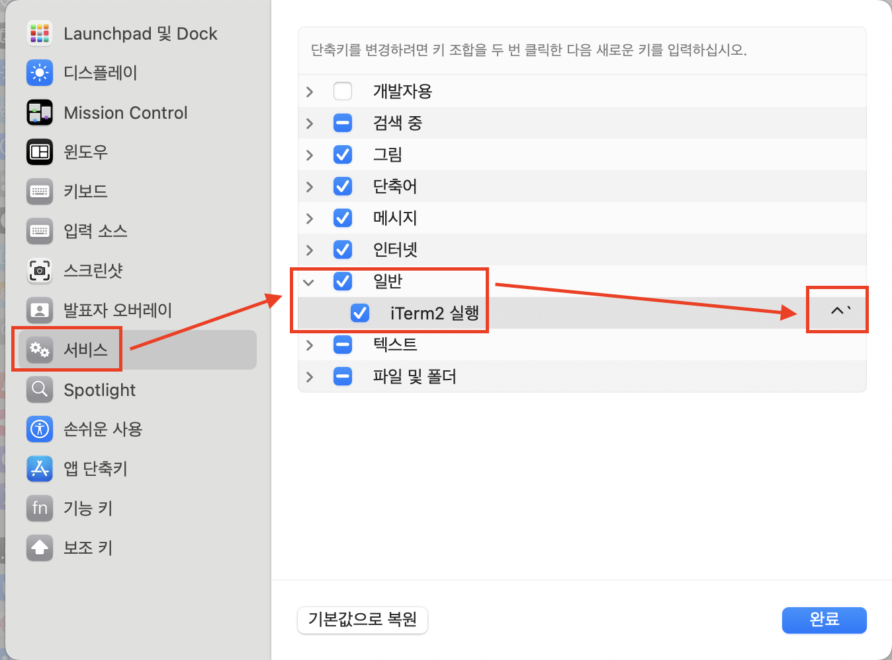

# MacOS에서 iTerm2의 단축키 설정 방법

## 1. Automator 설정
- 

## 2. 시스템 설정 > 키보드 > 키보드 단축키
- 

## 3. 서비스 > 일반 > iTerm2 실행 > 단축키 지정
- 

## 4. 파일 저장 위치
- ~/Library/Services/iTerm2 실행.workflow
---
## Reference
1. [Windows PC를 Jump Host(Proxy Jump)로 구성하는 방법](https://github.com/20eung/ssh-proxyjump)
2. [MacOS에서 iTerm2를 이용해 북마크 관리하는 방법](https://github.com/20eung/iterm2)
